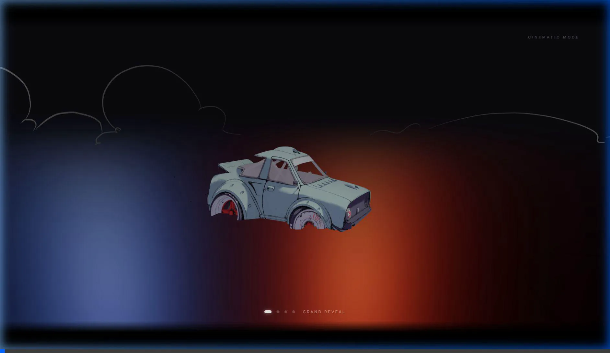

# 🚗 Three.js 3D Car Viewer

An interactive, high-end 3D car model viewer built with **Three.js** and **GSAP (GreenSock Animation Platform)**. It showcases a 3D model (GLB format) with automatic multi-angle cinematic camera paths, provides manual control capabilities, and opens with a premium loading screen transition.



---

## ✨ Features

- **GSAP Loading Screen** - Minimalist brand layout featuring a thin horizontal loader line ("web line") that expands horizontally and a monospaced percentage counter counting up to 100% dynamically.
- **Wipe-Down Reveal Transition** - Symmetrical slide-down curtain reveal that wipes the preloader away while fading/sliding loading elements up.
- **Cinematic Entrance Sweep** - A majestic, smooth camera sweep that zooms in from a distance to establish the 3D scene in sync with the slide-down reveal.
- **Multi-Angle Automated Paths** - Seamlessly loops through 4 cinematic camera tracks (Grand Reveal, Low Prowl, Rear Drama, Orbital Glide) with built-in camera drift simulating a handheld operator.
- **Manual Orbit Controls** - Toggle to manual view with **Spacebar** to zoom, rotate, and pan around the model using OrbitControls.
- **Seamless Re-Entry Blending** - When toggling back to Cinematic Mode, GSAP smoothly blends the camera position and focal target from the manual viewpoint back onto the cinematic track coordinates.
- **Lighting Rig & Dynamic Underglow** - Warm key light casting shadow maps, cool fill, back-rim backlight, and an animated colored underglow spot under the model.
- **Responsive Layout** - Automatically adapts camera aspect ratio and renderer frames to window resizing events.
- **Automated CI/CD Deploy** - Configured with GitHub Actions to compile Vite production bundles and deploy to GitHub Pages on every push to the `main` branch.

---

## 🎮 Controls

### Mouse Controls (Free Camera Mode)
- **Rotate view** - Left-click + drag
- **Pan view** - Right-click + drag
- **Zoom** - Mouse wheel

### Keyboard Controls
- **Spacebar** - Toggle between automated Cinematic Mode and manual Free Camera Mode.
- **1, 2, 3, 4** - Seamlessly transition to a specific cinematic camera path target.
- **Double-click (on Canvas)** - Toggle fullscreen mode.

---

## 📁 Modular Project Structure

The project has been refactored into a highly clean, decoupled, and modular structure under `src/`:

```
threejs/
├── .github/
│   └── workflows/
│       ├── deploy.yml      # CI/CD GitHub Pages deployment workflow
│       └── static.yml      # Static hosting check workflow
├── public/
│   ├── media/
│   │   └── preview.webp    # README live preview media asset
│   └── models/
│       └── car.glb         # 3D car model GLB asset
├── src/
│   ├── core/
│   │   ├── Scene.js        # Scene creation, fog, and background colors
│   │   ├── Camera.js       # Perspective camera, path configs, GSAP transition manager
│   │   ├── Renderer.js     # WebGLRenderer setups, shadow configurations, resize hooks
│   │   └── Controls.js     # OrbitControls initialization and parameters
│   ├── lights/
│   │   └── Lighting.js     # Lights rig (ambient, directional, point light underglow)
│   ├── objects/
│   │   ├── Ground.js       # Circular metallic ground plane configuration
│   │   └── CarModel.js     # GLTF loading, bounds mapping, sub-mesh shadow casting
│   ├── ui/
│   │   └── CinematicUI.js  # Letterbox bars, labels, dots, and GSAP preloader fades
│   └── index.css           # Global stylesheet, resets, and preloader overlays styling
├── index.html              # HTML entry point (links index.css and main.js)
├── main.js                 # Application orchestrator, event bindings, and animation loops
├── package.json            # Project dependencies and building scripts
├── Dockerfile              # Docker container settings
└── README.md               # This documentation file
```

---

## 🚀 Getting Started

### Prerequisites
- Node.js (v18 or higher recommended)
- npm

### Installation & Run

1. Clone the repository:
   ```bash
   git clone <repository-url>
   cd threejs-3d-car-viewer
   ```

2. Install dependencies:
   ```bash
   npm install
   ```

3. Run the local development server:
   ```bash
   npm run dev
   ```

4. Open your browser and navigate to the local URL (usually `http://localhost:5173/threejs-3d-car-viewer/`).

### Production Build & Preview
To compile the minified bundle:
```bash
npm run build
```
To run the production bundle locally:
```bash
npm run preview
```
